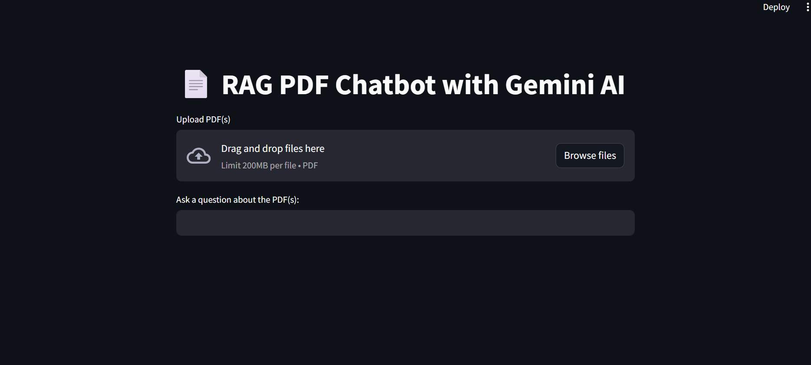
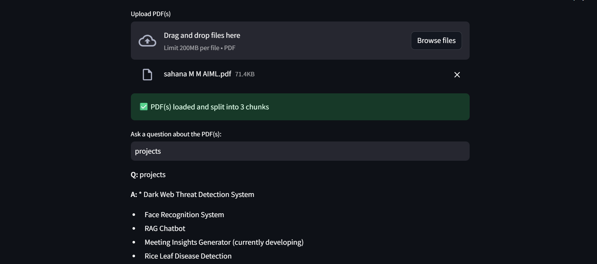
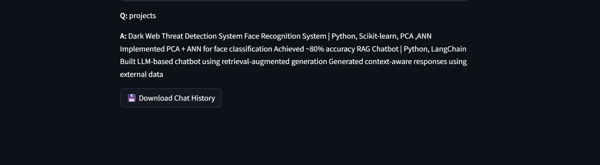

# 📄 RAG PDF Chatbot with Gemini AI

An AI-powered PDF chatbot built with **Streamlit**, **LangChain**, **ChromaDB**, and **Google Gemini AI**.

Upload one or multiple PDF files and ask questions about their content using Retrieval-Augmented Generation (RAG).

---

# 🚀 Features

- 📂 Upload multiple PDF files
- 🔍 Semantic search using ChromaDB
- 🤖 Gemini AI-powered question answering
- 🧠 Conversation memory (chat history)
- 📥 Download chat history as JSON
- ⚡ Fast document chunking and retrieval
- 📝 Source-aware responses

---

# 🛠️ Tech Stack

- Python
- Streamlit
- LangChain
- ChromaDB
- Google Gemini AI
- PyPDF
- dotenv

---

# 📦 Requirements

```txt
streamlit
python-dotenv
google-genai
langchain
langchain-community
chromadb
pypdf
```

Install dependencies:

```bash
pip install -r requirements.txt
```

---

# 🔑 Setup Environment Variables

Create `.streamlit/secrets.toml`

```toml
GEMINI_API_KEY="your_gemini_api_key"
```

Or use `.env`

```env
GEMINI_API_KEY=your_api_key
```

Get Gemini API Key:
https://makersuite.google.com/app/apikey

---

# ▶️ Run the Application

```bash
streamlit run app.py
```

---

# 📁 Project Structure

```text
├── app.py
├── requirements.txt
├── README.md
├── chroma_db/
└── .streamlit/
    └── secrets.toml
```

---

# 💡 How It Works

1. Upload PDF documents
2. PDFs are loaded using `PyPDFLoader`
3. Text is split into chunks
4. ChromaDB stores embeddings
5. User query retrieves relevant chunks
6. Gemini AI generates answers from retrieved context

---

# 📸 Output Screenshots







---

# 🎯 Example Questions

- "What is this PDF about?"
- "Summarize chapter 2"
- "What are the key findings?"
- "Explain the conclusion section"

---

# ⚠️ Notes

- Answers are generated only from uploaded PDF context
- If information is unavailable, the bot replies:

```text
I don't know.
```

- ChromaDB resets when new PDFs are uploaded

---

# 👨‍💻 Author

Built using Streamlit + LangChain + Gemini AI.
